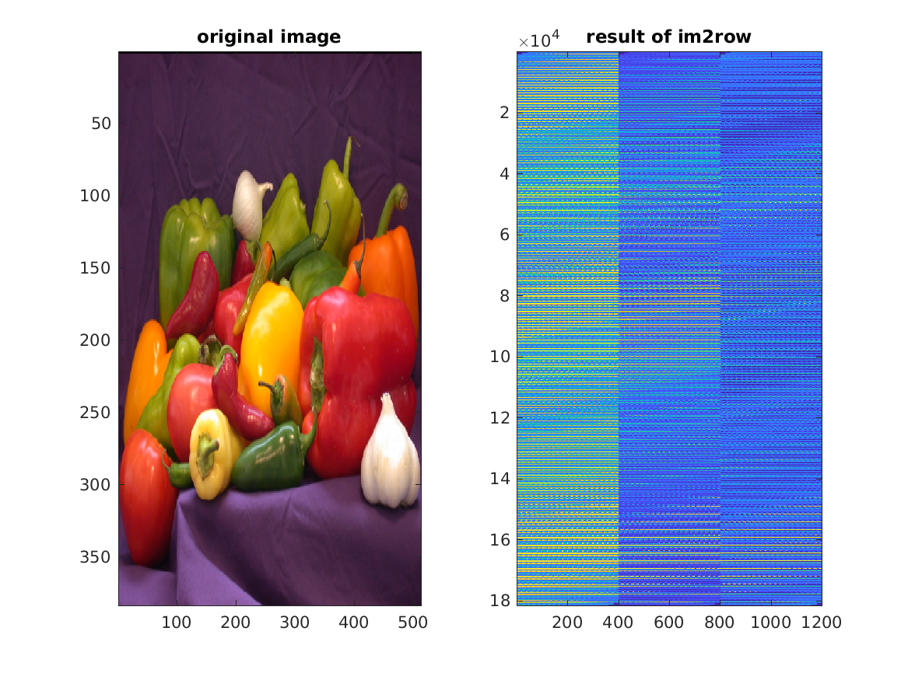

## mcnIm2row

Expose the MatConvNet C++ `im2row` function via MATLAB.

### Demo

To understand the `im2row` function, see Section 6.1 of the [MatConvNet manual](https://arxiv.org/pdf/1412.4564.pdf).  You can get some idea of the operation by examining the effect of `im2row` on example image (shown below for a kernel size of `[20, 20]`).  This figure can be produced by running `im2rowDemo.m`.

The mex interface code was written by James Thewlis.
